# Inline Icons

ptouch supports inline icons in text labels using the `:prefix-name:` shortcode syntax.
Icons are sourced from two open-source libraries and rendered as crisp vector graphics
at any font size.

## Icon Libraries

| Prefix | Library | License | Icons |
|--------|---------|---------|-------|
| `ti-` | [Tabler Icons](https://tabler.io/icons) | MIT | ~5000 outline icons |
| `bi-` | [Bootstrap Icons](https://icons.getbootstrap.com) | MIT | ~2000 icons (outline + fill variants) |

Browse the websites above to find icon names, then use them with the appropriate prefix.

## How It Works

1. Use `:ti-name:` or `:bi-name:` anywhere in a `--text` string
2. On first use, the icon SVG is downloaded from GitHub and cached locally
3. Subsequent uses load instantly from `~/.cache/ptouch/icons/`
4. Icons scale automatically to match the current font size
5. Unknown icon names are printed as literal text

## Examples

### Text with icon

```bash
ptouch print --text "I :ti-heart: labels"
```


### Multi-line with icons

```bash
ptouch print --text ":ti-alert-triangle: Caution" --text ":ti-bolt: High Voltage"
```

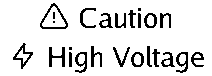

### Bootstrap filled icons

```bash
ptouch print --text ":bi-telephone-fill: Call me"
```


```bash
ptouch print --text ":bi-check-circle-fill: Done"
```


### Mixed text and icons

```bash
ptouch print --text ":ti-star: Rating: 5/5"
```


## Tabler Icons (outline)

Use with the `ti-` prefix. These are clean outline-style icons.

| Icon | Shortcode | Preview |
|------|-----------|---------|
| Heart | `:ti-heart:` | 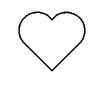{: width="40" } |
| Star | `:ti-star:` | {: width="40" } |
| Check | `:ti-check:` | 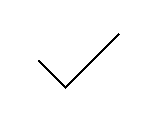{: width="40" } |
| Alert | `:ti-alert-triangle:` | 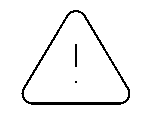{: width="40" } |
| Bolt | `:ti-bolt:` | 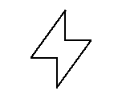{: width="40" } |
| Home | `:ti-home:` | 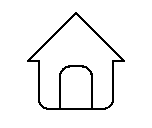{: width="40" } |
| Wifi | `:ti-wifi:` | 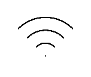{: width="40" } |
| Mail | `:ti-mail:` | {: width="40" } |
| Phone | `:ti-phone:` | 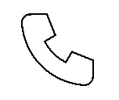{: width="40" } |
| Clock | `:ti-clock:` | 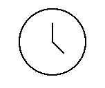{: width="40" } |
| Arrow right | `:ti-arrow-right:` | 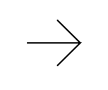{: width="40" } |
| Arrow left | `:ti-arrow-left:` | 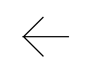{: width="40" } |
| Smile | `:ti-mood-smile:` | {: width="40" } |
| Flame | `:ti-flame:` | 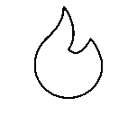{: width="40" } |
| Settings | `:ti-settings:` | {: width="40" } |
| Lock | `:ti-lock:` | 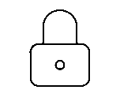{: width="40" } |

[Browse all Tabler Icons](https://tabler.io/icons){: .btn }

## Bootstrap Icons (filled)

Use with the `bi-` prefix. Many icons have both outline and `-fill` variants.

| Icon | Shortcode | Preview |
|------|-----------|---------|
| Heart | `:bi-heart-fill:` | {: width="40" } |
| Star | `:bi-star-fill:` | {: width="40" } |
| Check | `:bi-check-circle-fill:` | {: width="40" } |
| Warning | `:bi-exclamation-triangle-fill:` | {: width="40" } |
| Lightning | `:bi-lightning-fill:` | {: width="40" } |
| House | `:bi-house-fill:` | {: width="40" } |
| Wifi | `:bi-wifi:` | 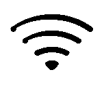{: width="40" } |
| Phone | `:bi-telephone-fill:` | {: width="40" } |
| Envelope | `:bi-envelope-fill:` | {: width="40" } |
| Clock | `:bi-clock-fill:` | {: width="40" } |
| Fire | `:bi-fire:` | {: width="40" } |
| Gear | `:bi-gear-fill:` | {: width="40" } |
| Lock | `:bi-lock-fill:` | {: width="40" } |
| Trash | `:bi-trash-fill:` | {: width="40" } |
| Eye | `:bi-eye-fill:` | {: width="40" } |
| Printer | `:bi-printer-fill:` | {: width="40" } |

[Browse all Bootstrap Icons](https://icons.getbootstrap.com){: .btn }

## Tips

- **Tabler** icons are outline-only and work great for clean, minimal labels
- **Bootstrap** icons have `-fill` variants that print bolder and more visible at small sizes
- You can mix both libraries in the same label: `:ti-star: :bi-heart-fill:`
- Icons work with all text features: multi-line, bold, alignment, fixed width
- Use `ptouch icons` on the command line for a quick reference

---

*[Tabler Icons](https://github.com/tabler/tabler-icons) and [Bootstrap Icons](https://github.com/twbs/icons) are open-source projects licensed under MIT.*
